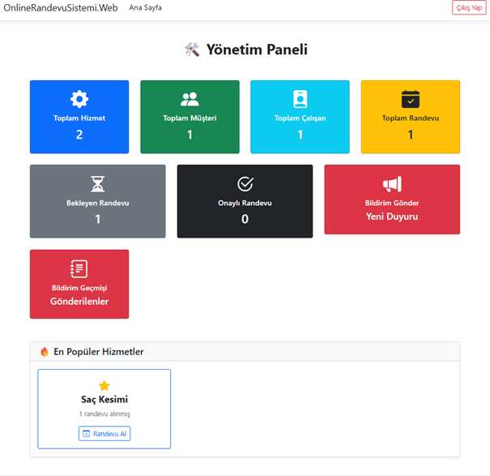
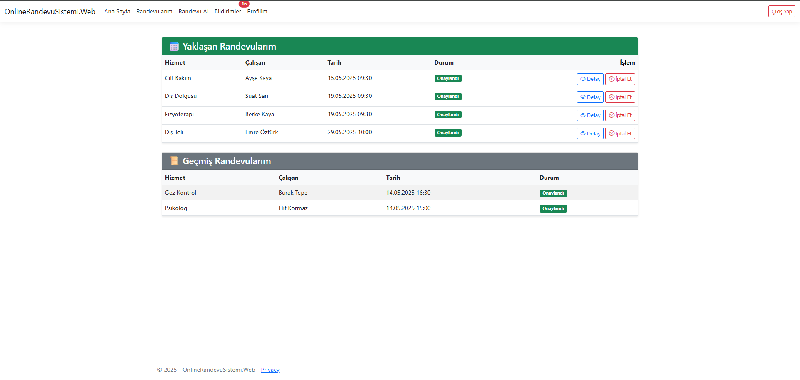
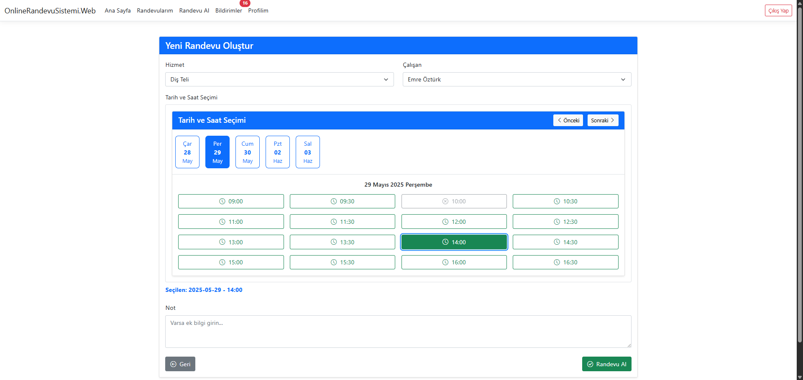
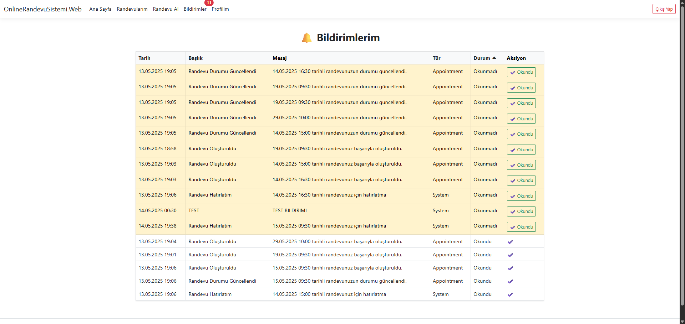

# 🗓️ Online Randevu Yönetim Sistemi

Online Randevu Yönetim Sistemi, işletmelerin randevu alma ve yönetim süreçlerini dijital ortama taşımasını sağlayan kapsamlı bir web uygulamasıdır. Kullanıcı dostu arayüzü ve modern teknolojik altyapısı sayesinde hem yöneticiler hem de çalışanlar hem de müşteriler için etkili bir randevu yönetim deneyimi sunar.

---

## 🚀 Proje Özellikleri

- ✅ Rol tabanlı kullanıcı giriş sistemi (Admin, Çalışan, Müşteri)
- ✅ JWT & Cookie Authentication
- ✅ Dinamik tarih-saat kontrolü ile randevu alma
- ✅ Randevu hatırlatma ve bildirim sistemi (SendGrid ile e-posta)
- ✅ Redis ve MemoryCache ile performanslı veri yönetimi
- ✅ Swagger ile RESTful API test ortamı
- ✅ Docker ile tam uyumlu çalışma

---

## 🧩 Kullanılan Teknolojiler

| Katman        | Teknoloji                  |
|---------------|-----------------------------|
| Backend       | ASP.NET Core 8.0            |
| Frontend      | Razor, Bootstrap 5, AJAX    |
| Veritabanı    | SQL Server 2022             |
| ORM           | Entity Framework Core       |
| Kimlik Sistemi| ASP.NET Identity + JWT      |
| Yetkilendirme | Role Based Access Control (RBAC)  |
| Önbellek      | Redis, MemoryCache          |
| E-posta       | SendGrid API                |
| API Test      | Swagger                     |
| Dağıtım       | Docker                      |

---

SendGrid API servisi bağlantı ayarları yapılmıştır fakat aktif değildir. Aktif etmek için ilgili yerdeki yorum satırlarlarını takip ederek aktif edebilirsiniz.

---


## 🖼️ Örnek Ekran Görüntüleri

### 👨‍💼 Admin Paneli


### 👤 Müşteri Randevuları


### 👤 Müşteri Randevu Oluşturma


### 🧑‍💼 Müşteri Bildirim Paneli


---

## ⚙️ Docker ile Kurulum
---

## 🏗️ Docker Ortamı ile Lokal Geliştirme Ortamı Arasındaki Farklar

| Bileşen        | Docker Ortamı (Production)            | Local (Development) Geliştirme Ortamı              |
|----------------|----------------------------------------|--------------------------------------|
| SQL Server     | Docker container içinde (`sqlserver`) | Lokal makinedeki SQL Server kullanılır |
| Redis Cache    | Docker container içinde (`redis`)     | Lokal Redis servisi gerekir veya devre dışı bırakılabilir |
| Uygulama       | `docker-compose up` ile çalışır       | Visual Studio veya `dotnet run` ile başlatılır |
| Ortam Değişkeni| `ASPNETCORE_ENVIRONMENT=Docker`   | `ASPNETCORE_ENVIRONMENT=Development` |
| Ayarlar        | `appsettings.Docker.json`         | `appsettings.Development.json`       |

**📌 `docker-compose.override.yml` ile local ortama özel ayarlar yapılabilir.**  

**📌 Redis veya SQL servisleri yüklü değilse Docker ortamı tercih edilmelidir.**


1. Reponuzu klonlayın:
```bash
git clone https://github.com/alperozyyurt4/OnlineRandevuSistemi.git
cd OnlineRandevuSistemi
```

2. Docker imajlarını oluşturun:
```bash
docker-compose build
```

3. Uygulamayı başlatın:
```bash
docker-compose up
```

> 🔗 Uygulama erişimi: http://localhost:5000  
> 📘 Swagger dokümantasyonu: http://localhost:5000/swagger

---

## 🔑 Seed Data Giriş Bilgileri

**Admin Girişi**  
🟢 E-posta: `admin@example.com`  
🟢 Şifre: `Admin123!`

---

## 📁 Proje Yapısı

```
📦 OnlineRandevuSistemi
├── OnlineRandevuSistemi.Api
├── OnlineRandevuSistemi.Web
├── OnlineRandevuSistemi.Business
├── OnlineRandevuSistemi.DataAccess
├── OnlineRandevuSistemi.Core
├── Dockerfile
├── docker-compose.yml
└── README.md
```

---

## 👨‍💻 Geliştirici

**Alper Özyurt**  
📧 [alperozyurt@gmail.com](mailto:alperozyurt@gmail.com)


---

## 📄 Lisans

MIT Lisansı © 2025 Alper Özyurt
